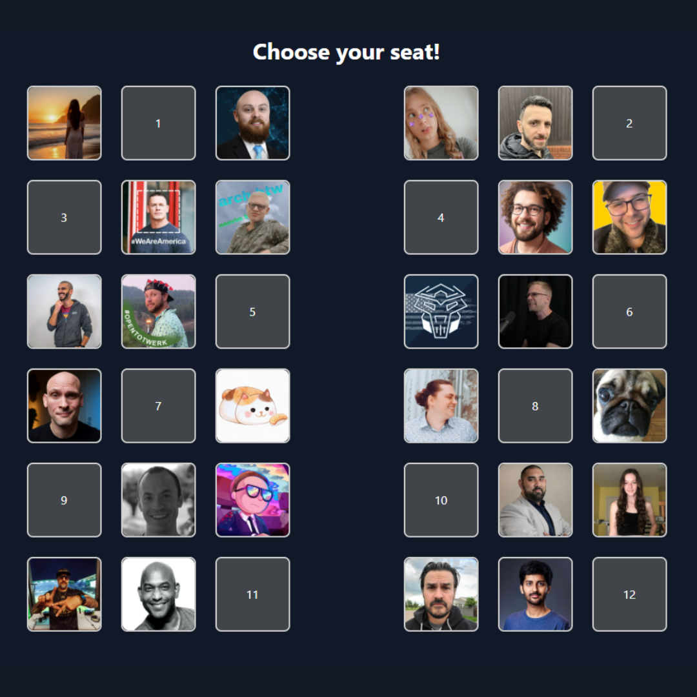

# Flight Seat - Who Would You Rather Sit With?

This project generates an airplane seating plan filled with Twitter/X users' profile pictures. It's designed for you to input the usernames of people you want to include and then generate a seating layout that you can screenshot and share on social media.

## Features

- Input up to 24 Twitter/X usernames
- Fetch and display profile pictures of the users
- Generate a visually appealing seating layout with aisles
- Easy to take screenshots for sharing on social media

## Usage

1. **Clone the Repository**

    ```sh
    git clone https://github.com/loftwah/flight-seat.git
    cd flight-seat
    ```

2. **Open the `index.html` File**

    Open the `index.html` file in your preferred web browser. You can simply double-click the file or drag and drop it into your browser.

3. **Enter Usernames**

    Enter the Twitter/X usernames you want to include in the seating layout into the input fields provided. Each input field corresponds to a seat in the airplane layout.

4. **Generate Seats**

    Click the "Generate Seats" button to fetch and display the profile pictures of the entered usernames in the seating layout.

5. **Screenshot and Share**

    Scroll to the bottom of the page to ensure there's enough spacing for a clean screenshot. Take a screenshot of the seating layout and share it on your social media platforms.

## Customization

- **Username Inputs**: You can add, remove, or modify the usernames in the input fields to customize who appears in the seating layout.
- **Styling**: The project uses Tailwind CSS for styling. Feel free to modify the Tailwind classes in the HTML file to change the appearance according to your preference.

## Technologies Used

- HTML
- Tailwind CSS
- JavaScript

## Example

Here is an example of how the seating layout will look after generating the seats with some usernames:



## Contributing

If you would like to contribute to this project, please fork the repository and create a pull request with your changes.

## License

This project is licensed under the MIT License.

## Contact

For any questions or suggestions, please contact [your email or GitHub profile].

---

**Note**: Ensure you have an active internet connection when using this project as it fetches profile pictures from Twitter/X.

**CORS Note**: You may encounter Cross-Origin Resource Sharing (CORS) issues when fetching profile images from Twitter/X. This is due to browser security restrictions that prevent web pages from making requests to a different domain than the one that served the web page. To overcome this, you can use a CORS proxy service or set up your own proxy to fetch the images.

Enjoy generating and sharing your unique airplane seating layouts!
